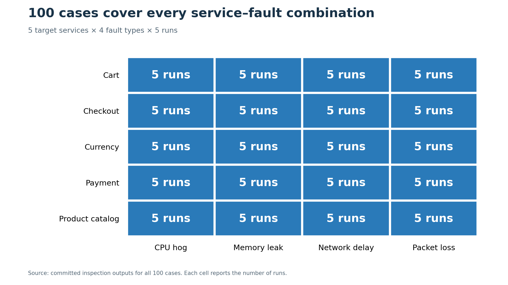
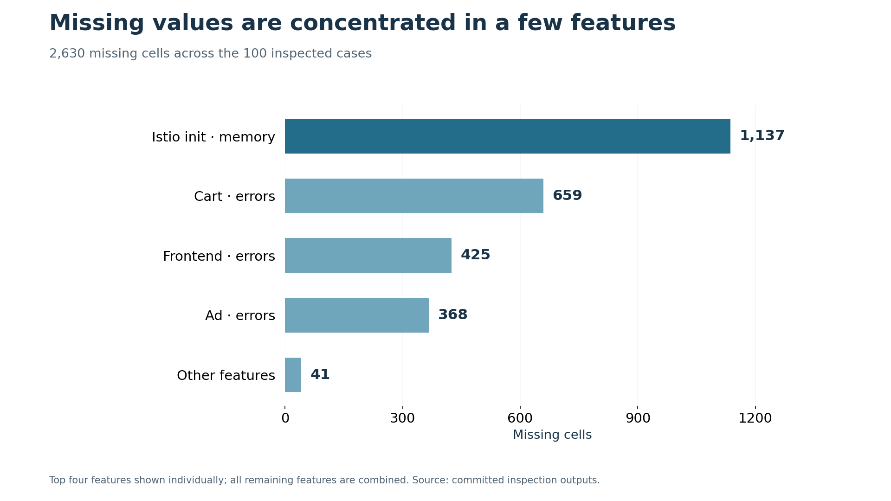
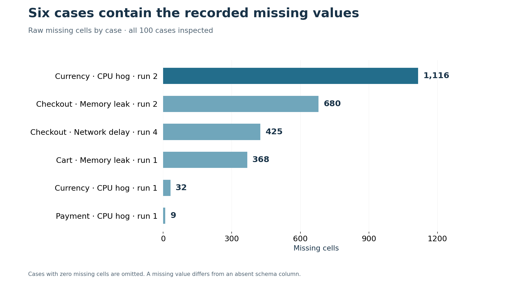
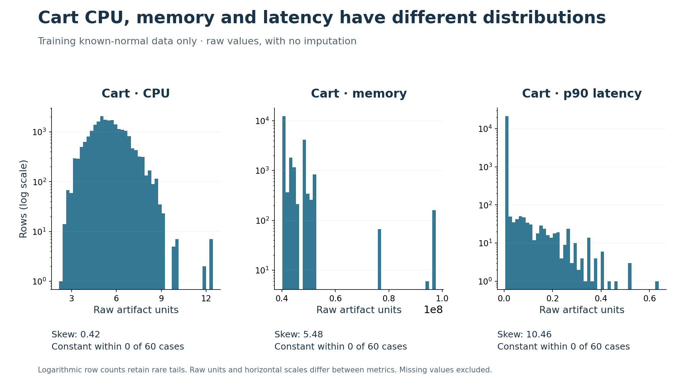
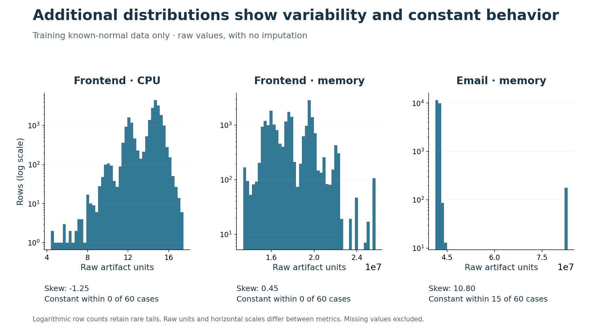
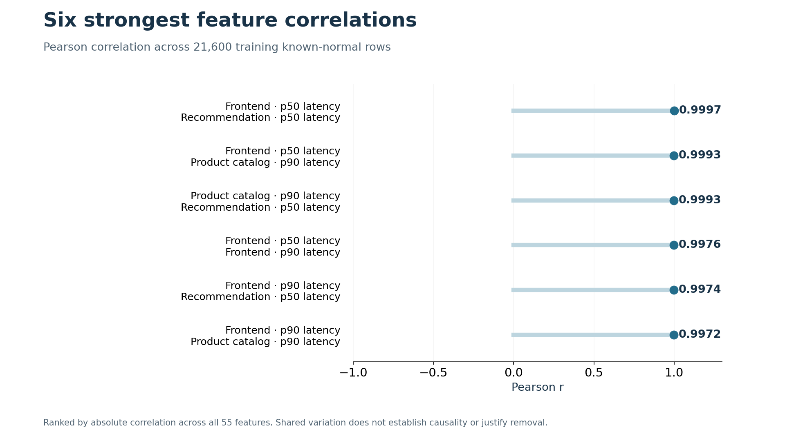
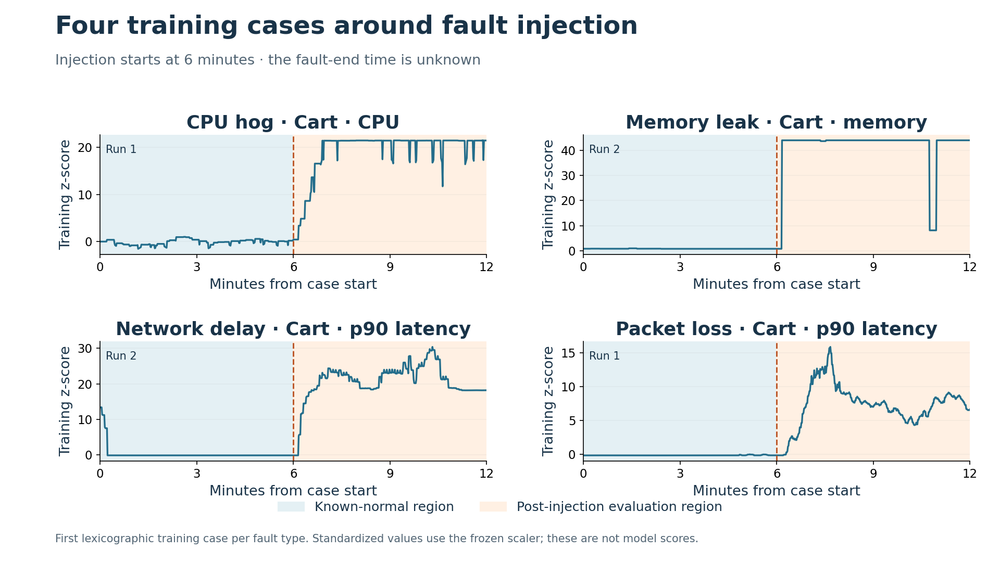
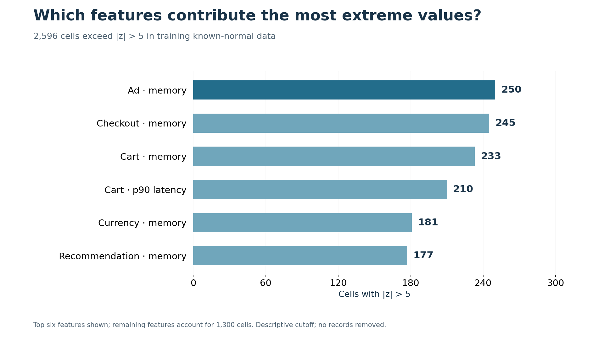
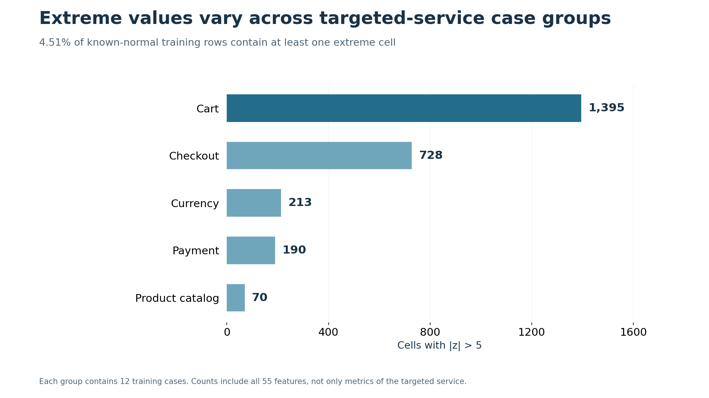

# Online Boutique EDA findings (298-38)

## Coverage and missingness

100 cases cover 5 target services and 4 fault types, with 5 runs per combination. See [coverage.csv](../../../data/model1/eda/coverage.csv). These structural counts reuse the committed inspection artifacts.

Exactly 2,630 raw missing cells are concentrated most in istio-init_mem (1,137 cells). See [missing_by_feature.csv](../../../data/model1/eda/missing_by_feature.csv) and [missing_by_case.csv](../../../data/model1/eda/missing_by_case.csv). Missing cells are distinct from columns absent from a case schema; Model 1 keeps its existing 55 common features.

## Distributions

Raw units and axis ranges differ across CPU, memory and latency signals. Log count axes retain rare tails. The final example is selected by the most training cases with constant behavior; the other examples are fixed semantic CPU/memory/latency choices. Constant within a case does not mean constant across the pooled dataset. [feature_statistics.csv](../../../data/model1/eda/feature_statistics.csv) records quantiles, skew and constant-case counts for every feature. No missing values are filled for these raw histograms.

## Correlations

Strongest pair: frontend_latency-50 / recommendationservice_latency-50, r=0.9997. Lowest mean absolute correlation: emailservice_latency-90 (0.0120). The full matrix is in [correlations.csv](../../../data/model1/eda/correlations.csv) and [full matrix figure](figures/04b_full_correlation_matrix.png). Large correlations suggest shared variation, not proven redundancy or causality. No features are removed. Correlations use the existing imputation/scaling function on training known-normal rows only.

## Fault injection examples

Examples are selected before examining behavior: the first lexicographic training case for each fault type. CPU uses targeted-service CPU, memory uses memory, and delay/loss use latency-90 as an observable response, not a direct fault label. [timeline_summary.csv](../../../data/model1/eda/timeline_summary.csv) quantifies each example; these four cases do not establish general fault-type effects. Shading after 360 s means post-injection evaluation region, not confirmed active fault duration.

## Extreme standardized values

2,596 of 1,188,000 training known-normal cells exceed |z| > 5 (0.219%), affecting 4.51% of rows. Largest feature contributor: adservice_mem (250 cells). Largest targeted-service group: cartservice (1395 cells). See [extremes_by_feature.csv](../../../data/model1/eda/extremes_by_feature.csv) and [extremes_by_case.csv](../../../data/model1/eda/extremes_by_case.csv). This reuses the demo’s descriptive cutoff, not a model threshold; no records are removed.

## Boundaries

All detailed EDA uses only the 60 training cases. Validation/test raw files and model performance are not read. Correlations, distributions and outlier analysis use the 21,600 known-normal training rows; timelines alone show full selected training cases. Raw-file hashes are verified unchanged before/after. There is no verified fault-end timestamp, and results are descriptive rather than evidence of model performance.

See [reproduction instructions and artifact index](README.md) and [provenance summary](../../../data/model1/eda/summary.json).
